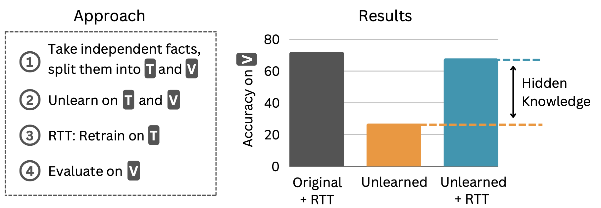

# Predicting relearning generalization by comparing gradients

---

# Language Model Unlearning and Fine-tuning Research

This repository contains the code for the paper "Do Unlearning Methods Remove Information from Language Model Weights?".


## Repository Structure

- `pipeline.py`: Main orchestration script for experiments.
- `unlearn_corpus.py`: Implementation of most unlearning methods.
- `finetune_corpus.py`: Used for fine-tuning and RTT.
- `conf/`: Hydra configuration files.
- `data/`: Directory for dataset files.

## Key Components
- The main experimental logic is in `pipeline.py`. Start here to understand the overall flow.
- For specific method implementations, refer to `unlearn_corpus.py`.
- RTT details can be found in `finetune_corpus.py`.
- Experiment configurations are managed through Hydra. Check the `conf/` directory for different setups.
   
## Running Experiments

1. Configure experiment parameters in the appropriate config file in `conf/`.
2. Execute experiments using:
   ```
   python pipeline.py
   ```

## Data

- Datasets should be placed in the `data/` directory.
### Dateset Directories
1. Years: `data/dates-years-trimmed`
2. MMLU: `data/mmlu_cats_random_trimmed`
3. WMDP-Deduped: `data/wmdp-deduped`
4. Random Birthdays: `data/random_bd`

### Dateset Files Naming Interpretation
1. The original MCQ questions are called `split_*.jsonl`.
2. The GPT-4o generated text splits have the prefix `corpus_`.
3. The text with incorrect facts (used for RIA) are prefixed with `whp_`.
